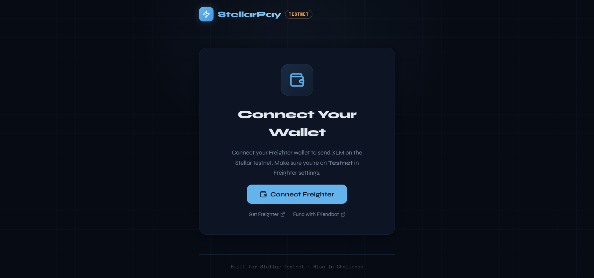
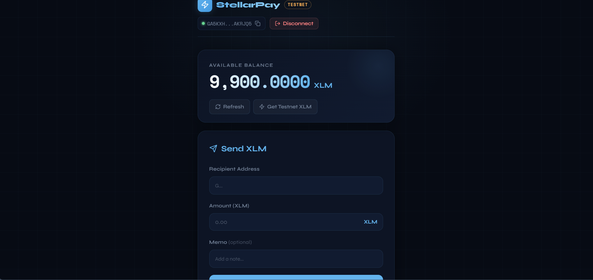
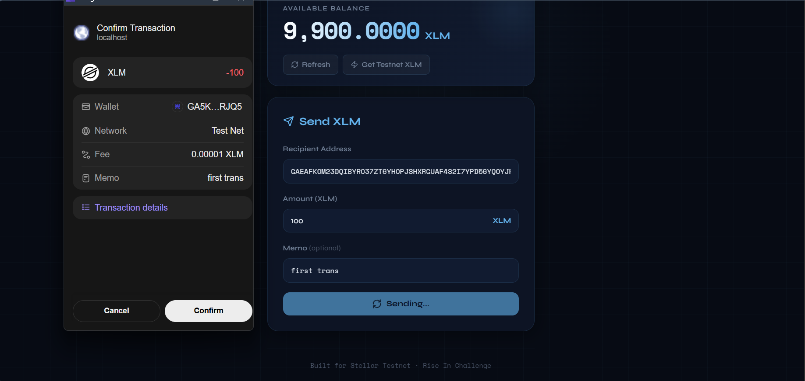
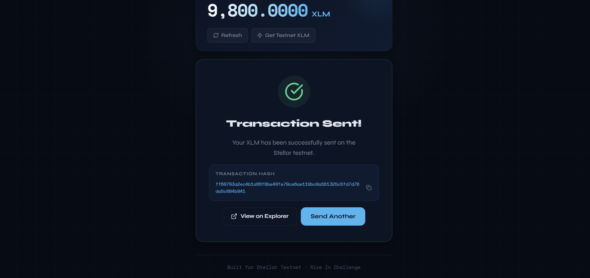

# StellarPay

A clean, minimal **XLM Payment dApp** built on the Stellar Testnet. Connect your Freighter wallet, check your balance, and send XLM to any Stellar address — all in one simple interface.

> Built for the **Rise In — Stellar Journey to Mastery: White Belt Challenge**

---

## Features

- **Wallet Connect / Disconnect** — Freighter wallet integration
- **Live XLM Balance** — fetched from Stellar Testnet via Horizon API
- **Send XLM** — send to any valid Stellar address with optional memo
- **Transaction Feedback** — success state with tx hash + link to Stellar Expert explorer
- **Error Handling** — clear error messages for invalid addresses, insufficient balance, etc.
- **Clean Dark UI** — responsive, mobile-friendly design

---

## Screenshots

### Connect Wallet Screen


### Balance Display


### Send XLM Form


### Transaction Result


---

## Setup Instructions

### Prerequisites

1. **Node.js** v18+ installed
2. **Freighter Wallet** browser extension — [freighter.app](https://freighter.app)
   - After installing, go to Settings → Network → switch to **Testnet**
3. **Testnet XLM** — fund your wallet via [Stellar Friendbot](https://laboratory.stellar.org/#account-creator?network=test)

### Run Locally

```bash
# 1. Clone the repository
git clone https://github.com/duyanhtr130905/stellarpay
cd stellarpay

# 2. Install dependencies
npm install

# 3. Start the dev server
npm run dev

# 4. Open http://localhost:5174 in your browser
```

### Build for Production

```bash
npm run build
npm run preview
```

---

## Tech Stack

| Tool | Purpose |
|------|---------|
| React 18 + TypeScript | UI framework |
| Vite | Build tool |
| `@stellar/stellar-sdk` | Stellar transaction building & Horizon API |
| `@stellar/freighter-api` | Wallet connection & transaction signing |
| Lucide React | Icons |

---

## Network

This app runs exclusively on **Stellar Testnet**.
- Horizon URL: `https://horizon-testnet.stellar.org`
- Explorer: [stellar.expert/explorer/testnet](https://stellar.expert/explorer/testnet)

---

## Project Structure

```
stellarpay/
├── screenshots/
├── src/
│   ├── hooks/
│   │   └── useFreighter.ts
│   ├── utils/
│   │   └── stellar.ts
│   ├── types/
│   │   └── stellar.ts
│   ├── App.tsx
│   ├── App.css
│   └── main.tsx
├── index.html
├── package.json
├── tsconfig.json
├── vite.config.ts
├── .gitignore
└── README.md
```

---

## License

MIT
