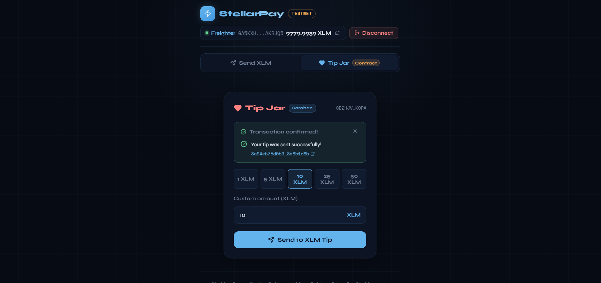
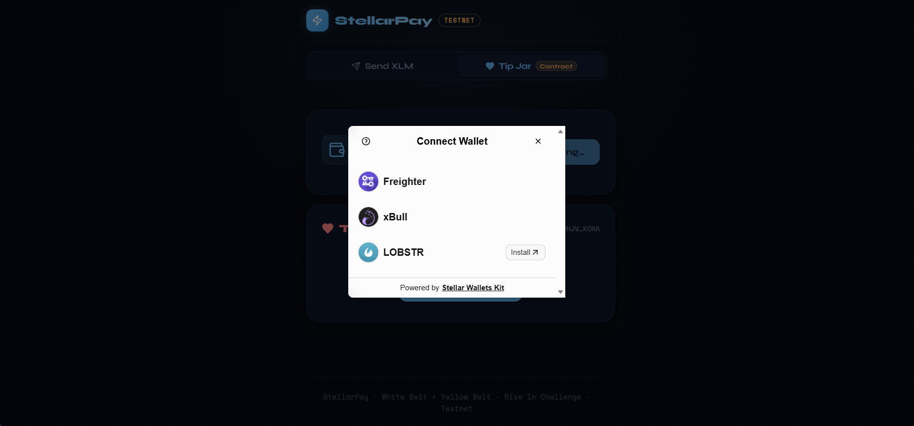

# StellarPay

A **multi-wallet XLM Payment & Tip Jar dApp** built on the Stellar Testnet. Send XLM directly or tip through a deployed Soroban smart contract — all from a single tabbed interface supporting **Freighter**, **xBull**, and **Lobstr** wallets.

> Built for the **Rise In — Stellar Journey to Mastery Challenge**
> **White Belt** (Send XLM) + **Yellow Belt** (Smart Contract Tip Jar)

---

## What's New in Yellow Belt

Building on top of the White Belt "Send XLM" feature, the Yellow Belt adds:

| Feature | Description |
|---------|-------------|
| **Multi-Wallet Support** | Integrated `@creit.tech/stellar-wallets-kit` v2 — supports Freighter, xBull, and Lobstr via a unified wallet selection modal |
| **Soroban Smart Contract** | `TipJarContract` written in Rust (`contract/src/lib.rs`) — stores tips, tracks totals, and emits events |
| **Contract Deployment** | Deployed to Stellar Testnet via `stellar-cli` with automated deploy script |
| **Frontend ↔ Contract** | Reads contract state (`get_info`, `get_my_tips`) and writes (`tip`) using Soroban RPC simulation + assembly |
| **3 Error Types** | `WALLET_NOT_FOUND`, `USER_REJECTED`, `INSUFFICIENT_BALANCE` — each with distinct UI styling |
| **Transaction Status Tracking** | 3-step progress bar: Building → Signing → Submitting with real-time updates |
| **Event-Driven Stats** | Tip Jar stats (total tips, tip count, owner) fetched from contract and refreshed after each successful tip |
| **Tabbed UI** | Clean tab system switching between "Send XLM" (White Belt) and "Tip Jar" (Yellow Belt) |

---

## Deployed Contract

| Item | Value |
|------|-------|
| **Contract ID** | `CB2HJVWQ3LVMNUCFRYSTPJLCPGTVCLYE6GR3YC5FAYSF6B6TUWDMKORA` |
| **Network** | Stellar Testnet |
| **Explorer** | [View on Stellar Expert](https://stellar.expert/explorer/testnet/contract/CB2HJVWQ3LVMNUCFRYSTPJLCPGTVCLYE6GR3YC5FAYSF6B6TUWDMKORA) |
| **Deploy TX** | [c0199a5b...43d612](https://stellar.expert/explorer/testnet/tx/c0199a5b9de44e1bda0fe9b3b72bd49d81ba7d9bdfc3a26c1cc683c52643d612) |
| **Initialize TX** | [376eb165...94cf9](https://stellar.expert/explorer/testnet/tx/376eb1655d8e05cffdc6c6c60f35c3e650719b2e20fa56430cfa27f225c94cf9) |
| **Contract Call TX (tip)** | [41e608fe4362...5187786a](https://stellar.expert/explorer/testnet/tx/41e608fe4362b4832a749d0543388b7ef7f1d3818d56b066932368bd5187786a) |

---

## Features

### White Belt (Send XLM)
- **Freighter Wallet** connect / disconnect
- **Live XLM Balance** — fetched from Horizon API
- **Send XLM** — to any valid Stellar address with optional memo
- **Transaction Feedback** — success state with tx hash + Stellar Expert link
- **Error Handling** — invalid addresses, insufficient balance, wallet errors

### Yellow Belt (Tip Jar + Smart Contract)
- **Multi-Wallet Selection** — Freighter, xBull, Lobstr via StellarWalletsKit modal
- **Soroban Tip Jar Contract** — send tips that are tracked on-chain
- **Contract Stats** — total tips, tip count, owner address read from contract
- **Preset Tip Amounts** — 1, 5, 10, 25, 50 XLM quick-select buttons
- **3-Step TX Progress** — Building → Signing → Submitting with live status bar
- **3 Error Types Handled**:
  - `WALLET_NOT_FOUND` — wallet extension not installed (yellow warning)
  - `USER_REJECTED` — user cancelled in wallet (red error)
  - `INSUFFICIENT_BALANCE` — not enough XLM (blue info)
- **Auto-Reconnect** — wallet session persisted in localStorage

---

## Screenshots

### Send XLM Tab (White Belt)


### Tip Jar Tab (Yellow Belt)


### Wallet Options (Multi-Wallet Selection)


---

## Setup Instructions

### Prerequisites

1. **Node.js** v18+ installed
2. **Wallet Extension** — at least one of:
   - [Freighter](https://freighter.app)
   - [xBull](https://xbull.app)
   - [Lobstr](https://lobstr.co)
3. Switch wallet to **Testnet** in settings
4. **Testnet XLM** — fund via [Stellar Friendbot](https://laboratory.stellar.org/#account-creator?network=test)

### Run Locally

```bash
# 1. Clone the repository
git clone https://github.com/duyanhtr130905/stellarpay
cd stellarpay

# 2. Install dependencies
npm install

# 3. Start the dev server
npm run dev

# 4. Open http://localhost:5173 in your browser
```

### Deploy the Smart Contract (Optional)

If you want to deploy your own copy of the Tip Jar contract:

**Prerequisites:** Rust, `wasm32-unknown-unknown` target, and `stellar-cli` installed.

```bash
# Install Rust (if not installed)
# Windows: winget install Rustlang.Rustup
# Mac/Linux: curl --proto '=https' --tlsv1.2 -sSf https://sh.rustup.rs | sh

# Add WASM target
rustup target add wasm32-unknown-unknown

# Install Stellar CLI
cargo install --locked stellar-cli

# Deploy (PowerShell on Windows)
powershell -ExecutionPolicy Bypass -File deploy_contract.ps1

# Deploy (Bash on Mac/Linux)
bash deploy_contract.sh
```

The deploy script will:
1. Create a `deployer` identity and fund it with testnet XLM
2. Build the Soroban WASM contract
3. Deploy to Stellar Testnet
4. Initialize the Tip Jar
5. Write the `VITE_CONTRACT_ID` to `.env`

After deploying, restart the dev server to pick up the new contract ID.

### Build for Production

```bash
npm run build
npm run preview
```

---

## Tech Stack

| Tool | Purpose |
|------|---------|
| React 18 + TypeScript | UI framework |
| Vite | Build tool |
| `@stellar/stellar-sdk` v15 | Stellar transaction building, Soroban RPC & Horizon API |
| `@stellar/freighter-api` | Freighter wallet connection (White Belt) |
| `@creit.tech/stellar-wallets-kit` v2 | Multi-wallet integration (Yellow Belt) |
| `soroban-sdk` v22 (Rust) | Smart contract development |
| `stellar-cli` v26 | Contract deployment & invocation |
| Lucide React | Icons |

---

## Smart Contract

The Tip Jar contract (`contract/src/lib.rs`) implements:

| Function | Type | Description |
|----------|------|-------------|
| `initialize(owner, token)` | Write | Set tip jar owner and XLM token address |
| `tip(tipper, amount)` | Write | Transfer XLM from tipper to owner, update stats |
| `get_info()` | Read | Return owner, total tips, tip count |
| `get_my_tips(tipper)` | Read | Return how much a specific address has tipped |

Events emitted: `tipjar/init` on initialization, `tipjar/tip` on each tip.

### Smart Contract Tests

The contract includes **5 unit tests** (`cargo test` from `contract/`):

| Test | What it verifies |
|------|------------------|
| `test_initialize` | `initialize()` sets owner, zeroes totals, `get_info()` returns correct data |
| `test_tip` | `tip()` transfers XLM, updates stats (total_tips, tip_count), tracks per-tipper amount |
| `test_tip_updates_stats_cumulatively` | Multiple tips from different addresses accumulate correctly |
| `test_tip_zero_amount_panics` | `tip()` with amount ≤ 0 panics with "amount must be positive" |
| `test_double_initialize_panics` | Calling `initialize()` twice panics with "already initialized" |

```bash
cd contract
cargo test
# test result: ok. 5 passed; 0 failed
```

---

## Network

This app runs exclusively on **Stellar Testnet**.
- Horizon URL: `https://horizon-testnet.stellar.org`
- Soroban RPC: `https://soroban-testnet.stellar.org`
- Explorer: [stellar.expert/explorer/testnet](https://stellar.expert/explorer/testnet)

---

## Project Structure

```
stellarpay/
├── contract/                    ← Soroban smart contract (Rust)
│   ├── Cargo.toml
│   └── src/lib.rs
├── src/
│   ├── hooks/
│   │   ├── useFreighter.ts      ← White Belt: Freighter-only wallet hook
│   │   └── useWallet.ts         ← Yellow Belt: Multi-wallet hook (StellarWalletsKit)
│   ├── utils/
│   │   ├── stellar.ts           ← White Belt: Horizon helpers
│   │   └── contract.ts          ← Yellow Belt: Soroban RPC helpers
│   ├── types/
│   │   ├── stellar.ts           ← White Belt types
│   │   └── index.ts             ← Yellow Belt types (WalletError, TxState, TipJarInfo)
│   ├── components/
│   │   ├── TipJar.tsx           ← Tip Jar UI with stats, presets, form
│   │   └── TxStatusBar.tsx      ← 3-step transaction progress bar
│   ├── App.tsx                  ← Main app with tabbed layout
│   ├── App.css                  ← All styles (base + Yellow Belt additions)
│   └── main.tsx
├── deploy_contract.sh           ← Bash deploy script
├── deploy_contract.ps1          ← PowerShell deploy script (Windows)
├── .env                         ← VITE_CONTRACT_ID (auto-generated by deploy)
├── index.html
├── package.json
├── tsconfig.json
├── vite.config.ts
└── README.md
```

---

## Error Handling

| Error Type | Trigger | UI Style |
|------------|---------|----------|
| `WALLET_NOT_FOUND` | Wallet extension not installed | ⚠️ Yellow warning |
| `USER_REJECTED` | User cancelled/closed wallet prompt | ❌ Red error |
| `INSUFFICIENT_BALANCE` | Not enough XLM (need 0.5+ for fees) | ℹ️ Blue info |

---

## License

MIT
